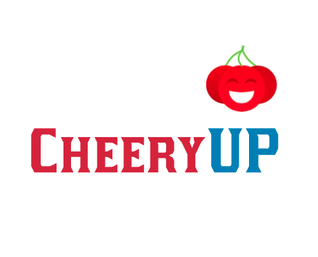

   

## ℹ️ Sobre o projeto

 O CheeryUP é um sistema direcionado para psicólogos que foi arquitetado por Carla Silva Rocha Aguiar, com a ideia de disponibilizar uma plataforma online para prontuário de atendimento de pacientes que estão em fase de recuperação da COVID-19.

 O principal intuito do projeto, é auxiliar a saúde mental dos indivíduos que se encontram em isolamento social. Outro fator, é coletar dados para definir quais ações preventivas e corretivas, podem ser realizadas em um cenário semelhante.
 

## Principais funcionalidades
* Registro de pacientes, consultas e sintomas.
* Monitoramento clínico dos pacientes, com quadro evolutivo dos mesmos.
* Dashboards para monitorar todo o banco de dados do sistema.

## Tecnologias
< adicionar figura de todas as tecnologias que foram utilizadas >

## Como contribuir ?
Para contrubuir com o projeto você deve seguir esses padrões:
* [Guia de contruibuição](https://github.com/fga-eps-mds/2020.2-CheeryUP/blob/main/CONTRIBUTING.md)
* [Código de conduta](https://github.com/fga-eps-mds/2020.2-CheeryUP/blob/main/CODE_OF_CONDUCT.md)
* [Como rodar o Cheery ?](#como-rodar-o-cheery-?)
* [Template para ISSUES](https://github.com/fga-eps-mds/2020.2-CheeryUP/tree/main/.github/ISSUE_TEMPLATE)
* [Template para commit's](https://github.com/fga-eps-mds/2020.2-CheeryUP/blob/main/docs/templates/commit_template.md)
* [Template para pull requests](https://github.com/fga-eps-mds/2020.2-CheeryUP/blob/main/.github/pull_request_template.md)

## Como rodar o Cheery ?
Elaborar os passos para rodar a plataforma...
