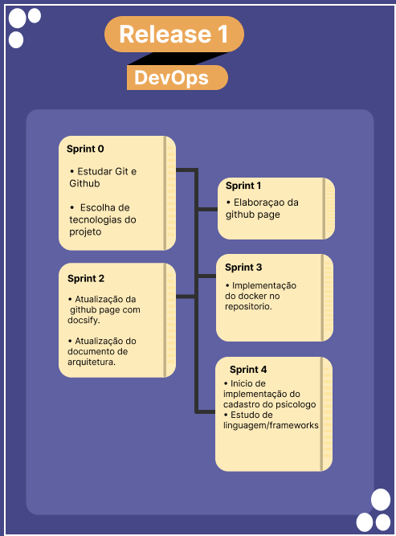

## Histórico de revisão

|       Data         |versão                       |Descrição                        |Autor|
|----------------|-------------------------------|-----------------------------|---------------------|
|20/02/2021|1.0.0           |Criação do roadmap Devops              |Abraão Alves|

## Realese 01

- estudar git e github.
- Escolha e configuração de tecnologias e ferramentas para o projeto.
- Elaboraçao da github page.
- Atualização da github page com docsify.
- atualização do documento de arquitetura.
- Estudar e escolher melhores ferramentas para uma integração continua.
- Treinamento e implementação do docker.
- implementação da US01-Cadastro Psicologo.
- Integração  Continua 
- Implementação dos modulos do Banco de Dado.
- Organização do planejamento de Horario/Identidade Visual/ATAS

 &emsp;&emsp;  

