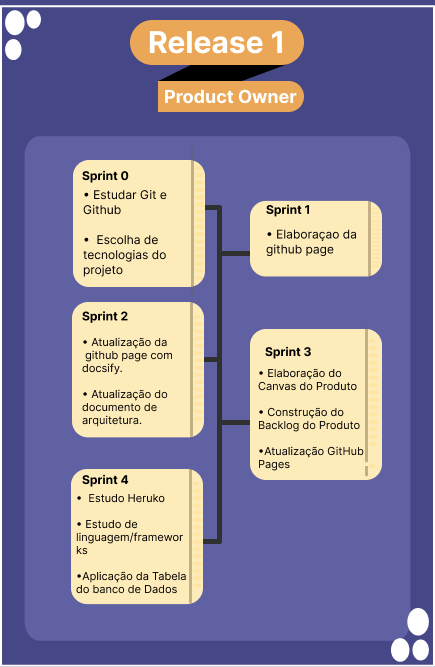

# RoadMap ProductOwner

## Histórico de revisão
| Data   | Versão | Modificação  | Autor  |
| :- | :- | :- | :- |
| 24/02/2021 | 1.0.0 | Abertura do Roadmap do Product Owner |  Davi Matheus |

### Release 1

-   Definir escopo inicial.
-   Elaborar Product Backlog.
-   Elaborar GitHub.
-   Priorizar Docker.
-   Priorizar Product Backlog para o uso das sprints.
-   Definir issues, sprints e metas para elaboração do projeto.
-   Gerenciar a equipe. 
-   Analise de Riscos
-   Atualizar o produto de acordo com a evolução.
-   Elaboração do Canvas. 
-   Estudo Heruko/lingugem e Frameworks
-   Documentação da Metodologia 
-   Atualização do Repositorio/GitHub Pages
-   Revisão de Docs para a Release 1

 &emsp;&emsp;  

## Release 2 

