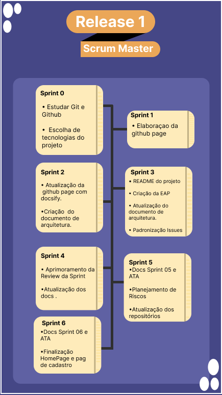

## Histórico de revisão

|       Data         |versão                       |Descrição                        |Autor|
|----------------|-------------------------------|-----------------------------|---------------------|
|25/02/2021|1.0.0           |Criação do roadmap ScrumMaster              |Nilvan Peres|

## Realese 01

* Definição do escopo inicial.
* Implementação do github pages para os documentos do projeto.
* Elaboração de templates para padronização.
* Plannings e reviews das sprints.
* Elaborar plano de comunicação da equipe e monitoramento da mesma.
* Criação do TAP.
* Criaçaõ da EAP.
* Destrinchar requisitos.
* Elabaração de plano de gerenciamento de riscos/custos.
* Monitoração da metodologia e risco projeto.  
   

 &emsp;&emsp;  

## Release 02