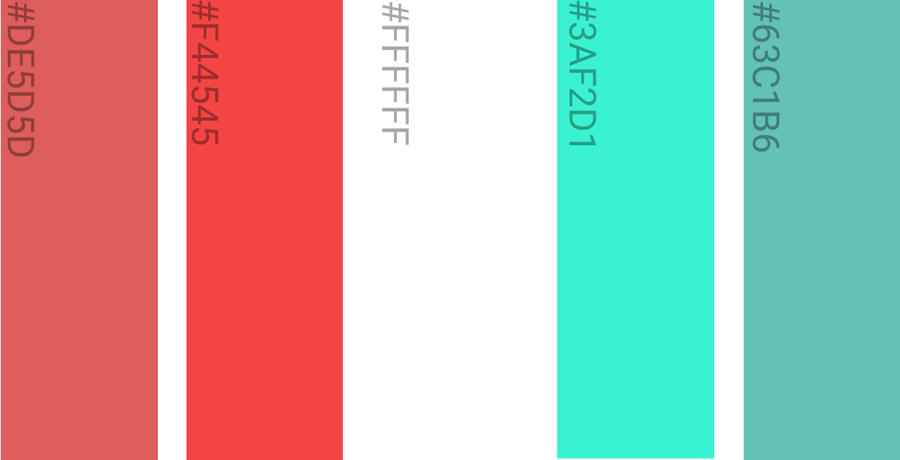
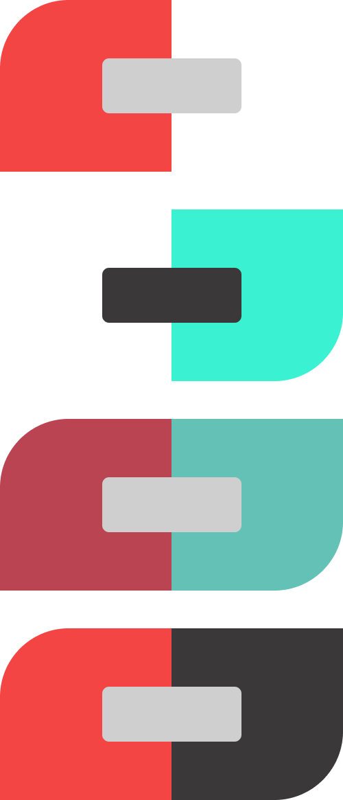
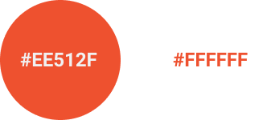
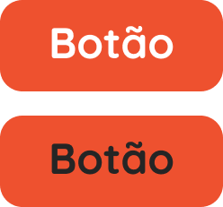
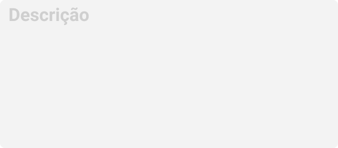
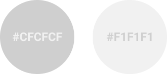
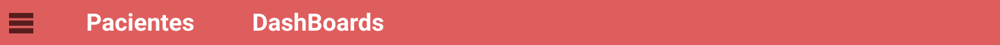
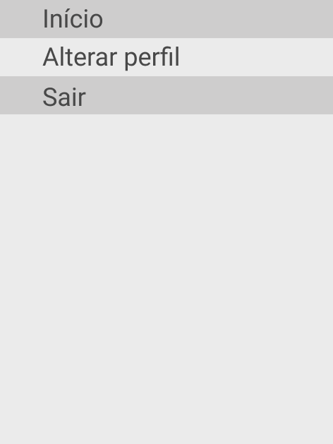
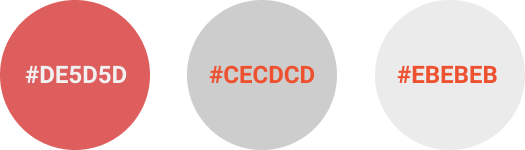
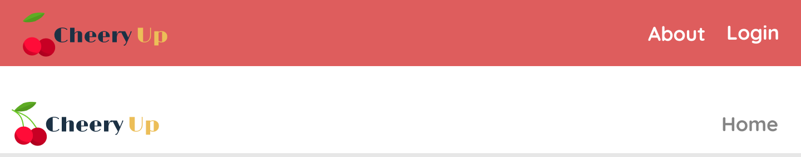

# Guia de estilo e indentidade visual

## Histórico de Revisão

| Data   | Versão | Modificação  | Autor  |
| :- | :- | :- | :- |
| 14/03/2021 | 0.1 | Inicialização do documento | Natanael Fernandes |

## 1. Introdução 

### 2.  Detalhamento e Justificativas

### 2.1. Nome do projeto

O nome do projeto é um trocadilho com as palavras "cherry" e "cheers up", respectivamente cereja e se anime, juntando em Cheery Up. Com isso, a aplicação ajudará pessoas com problemas psicológicos devido a pandemia do COVID-19 e uma doce cereja pode ser um prato cheio na vida de quem está passando por dificuldades.
### 2.2. Fontes

A fonte utilizada será a Roboto (Apache License), para textos, já que são fontes que foram utilizadas nos protótipos do projeto e são simples.

#### 2.2.1. Uso da fonte

Para o html reconhecer a fonte, coloca-se no <head> da seguinte forma:

    <link href="https://fonts.googleapis.com/css?family=Raleway|Roboto&display=swap" rel="stylesheet">

Para o css:
    
    font-family: 'Roboto', sans-serif;

## 3. Cores
### 3.1. Paleta de cores

### 3.2. Contraste

A cor primaria é a #F44545, segunda na paleta de cores e a secundaria #3AF2D1

## 4. Componentes
### 4.1. Botões

Existe apenas um tipo de botão para este projeto, sendo assim suas propriedades são:
- Arredondamento de 25px nas bordas;
- Texto centralizado com a função do botão;
- Tonalidades:

    
- Exemplos:

    

### 4.2. Campos de formulários

Os campos de formulários possuem uma altura padronizada de 60px e largura variável com a necessidade. Entretanto, os campos de descrição não segue o padrão de altura e possuem altura variável com o que for desejado. Alpem disso, os campos possuem um raio de arredondamento de 10px em cada borda.

Exemplo padrão:

Exemplo descrição:

As cores presentes nos campos de formulário:

 

### 4.3. Navbar

Os campos de Navbar são em um tom de vermelho, apresentando ao psicólogo o diretório para seus pacientes e Dashboard, além de opções para seu perfil.

 
 

### 4.4. Headers

Os headers são de tom avermelhado ou brancos, acompanhados com a logo Cheery Up e outras opções.

