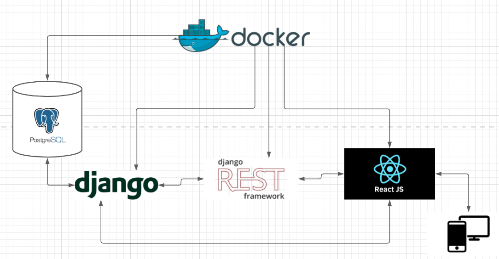

## Histórico de Versões

| Versão  |  Data  | Autor  |  Descrição  |
| ------------------- | ------------------- | ------------------- | ------------------- |
| 1.0.0 | 17/02/2021  | Davi Matheus  | Estrutura inicial  |
| 1.0.1 | 17/02/2021  | Nilvan Peres  | Adição dos tópicos 1,2 e 3 |
| 1.0.2 | 25/02/2021  | Antonio e Arthur | Implementação da Visão de Dados |
| 1.0.3 | 25/02/2021  | Natanel Fernandes | Adição do DER |
| 1.0.4 | 25/02/2021  | Davi e Aabrão | Implementação da Visão de Caso de Uso |
## Sumário
[1 - Introdução](#1---introdução)
* [1.1 - Objetivo](#1.1---objetivo)
* [1.2 - Escopo](#1.2---escopo)
* [1.3 - Visão Geral](#1.3---Visão-Geral)
* [1.4 - Definições, acrônimos e abreviações](#1.4---Definições,-acrônimos-e-abreviações)

[2 - Represetanção de Arquitetura](#2---Represetanção-de-Arquitetura)

* [2.1 - Padrão Arquitetural](###2.1---Padrão-Arquitetural)
* [2.2 - Tecnologias](#2.2---Tecnologias)

[3 - Metas e Restrições da Arquitetura](#3---Metas-e-Restrições-da-Arquitetura)

* [3.1 - Metas](#3.1--Metas)
* [3.2 - Restrições da Arquitetura](#3.2--Restrições-da-Arquitetura)

[4 - Visão de Dados](#4---Visão-de-Dados)
* [4.1 - Modelo Entidade Relacionamento (MER)](#4.1---Modelo-Entidade-Relacionamento-(MER)) 
    * [4.1.1 - Entidades](#4.1.1---Entidades)
    * [4.1.2 - Relacionamentos](#4.1.2---Relacionamentos)
* [4.2 - Diagrama Entidade Relacionamento (DER)](#4.2---Diagrama-Entidade-Relacionamento-(DER)) 

[ 5 - Visão de Caso de Uso](#5---Visão-de-Caso-de-Uso)

* [5.1 - Diagrama de caso de Uso](#5.1---Diagrama-de-caso-de-Uso)
* [5.2 - Atores de Caso de Uso](#5.2---Atores-de-Caso-de-Uso)
* [5.3 - Descrições de Caso de Uso](#5.3---Descrições-de-Caso-de-Uso)
## 1 - Introdução

### 1.1 - Objetivo 
O objetivo deste documento é dissecar a arquitetura do projeto ***mindXcovid***, de modo que, todo a visão arquitetural do sistema que será desenvolvido esteja clara.  
Outro ponto que será abordado, são as principais características do software permitindo que desenvolvedores/gestores entendam os processos que levaram na escolha das tecnologias e decisões a respeito dessa arquitetura.

### 1.2 - Escopo
A plataforma web ***mindXcovid*** será desenvolvida para ser um prontuário de atendimento psicológico a pacientes em fase de recuperação de covid-19, facilitando a acompanhamento, exames e orientações dos pacientes, o profissional da saúde vai poder agendar, gerenciar e registrar atendimentos. Além de business inteligence a partir dos dados inseridos pelos psicológos. 
Os componenete de software, frameworks, plataformas de desenvolvimento utilizados serão descritos neste documento.

### 1.3 - Visão Geral
Este documento é dividio nas seguintes seções:
* Introdução: Explica o propósito e organização do documento.
* Representação Arquitetural: Apresenta a arquitetura adotada para desenvolver o projeto.
* Metas e Requisitos de Software: Destrincha os requisistos de usabilidade do software, e as metas mais relevantes para o sistema que será desenvolvido.
* Visão de dados: Apresentação de todos os dados e métricas da aplicação.
* Visão de Casos de uso: Apresentação de todos os casos de uso da aplicação.
* Referências bibliográficas: Material de apoio na elaboração desse documento

### 1.4 - Definições, acrônimos e abreviações

| **Sigla/Termo/Acrônimo** | **Definição** |
| ------------------------ | ------------- |
| API | Application Programming Interface | 
| OMR | Mapeamento de objeto Relacional | 
| MDS | Métodos de Desenvolvimento de Software | 
| EPS | Engenharia de Produto de Software| 
| FGA | Faculdade do Gama | 
| UnB | Universidade de Brasília | 
| DRF | Django Rest Framework |
| MTV | Model Template View |
| MVC | Model View Controller |

## 2 - Represetanção de Arquitetura

 &emsp;&emsp;  

### 2.1 - Padrão Arquitetural
O padrão de aquitetura adotado será o MVC (Modelo Visão e Controle). Ele é um modelo que contribui na otimização da velocidade entre as requisições feitas pelo comando do usuário. Cada componente da arquitetura é construído para lidar com alguma parte específica do desenvolvimento da aplicação. Os três componentes que serão utilizados nesse projeto serão destrinchados abaixo: 
* Model : Esse componente armazena dados, e está relacionado com a parte lógica. Essa parte será desempenhada pelos framework Django e com o mySQL para a manipulação de dados.
* View: É parte da aplicação que será visível ao usuário, a apresentação dos dados. A ferramenta que fará isso no nosso projeto é o react.js.
* Controller: É parte que lida com a interação do usuário com a aplicação, ele interpreta as inputs do usuário, comunica a model e a view muda de acordo as mudanças feitas.

### 2.2 - Tecnologias
|tecnologias | descrição |
| ------------------- | ------------------- |
| Python | Linguagem para o desenvolvimento do backend |
| Django | Framework que segue a arquitetura MVC, fará comunicação do back com o banco de dados |
| MkDocs | Gerador de site estático, voltado a criação de documentações markdown
|Bootstrap |  Framework para desenvolvimento em HTML e JS. |
| React |  Biblioteca em javascript com foco em criar inteface de usuário em páginas web. |
|Docker | Criação e administração de ambientes de desenvolvimento |
|Docker-compose |  Para a comunicação dos containers criados pelo docker |
|Git | Git é um sistema de controle de versão distruibuído, com estímulos a projetos open source |
|HTML |  Será utiliza para implementação do frontend junto ao jss |
|JavaScript |  Alia-se no desenvolvimento do frontend junto com HTML e |
|mySQL | Banco de dados relacional, será usado para gerir a base de dados|

  

### 3 - Metas e Restrições da Arquitetura

#### 3.1 - Metas
* Facilitar o acompanhamento psicológico;
* Automatizar processos de agendamento, e registros de atendimentos;
* Acompanhamento no quadro de evolução dos pacientes;
* Dashboards com métricas e indicadores da saúde mental de determinada comunidade; 

#### 3.2 - Restrições da Arquitetura
* Ter acesso a internet;
* Possuir um navegador de internet (Google Chrome 60, Safari, Mozilla Firefox 55, Opera 47 e Microsoft Edge);
* Cadastro no site;

## 4 - Visão de Dados

### 4.1 - Modelo Entidade Relacionamento (MER)

### 4.1.1 - Entidades
* ### Usuário
|Atributos| Propriedade | Tipo | Descrição|
|-----|-----|------|-----|
| idUsuario | Chave primária obrigatória | String | Identificação do Usuário |
| nome | Obrigatório | String | Nome do usuário |
| sexo | Obrigatório | String | Sexo do usuário |
| email | Obrigatório | String | Email do usuário |
| cpf | Obrigatório | String | CPF do usuário |
| telefone | Obrigatório | String | Telefone do usuário |
| senha | Obrigatório | String | Senha do usuário |

* ### Administrador
|Atributos| Propriedade | Tipo | Descrição|
|-----|-----|------|-----|
| idAdm | Chave primária obrigatória | String | Identificação do Administrador |
| idUsuario | Chave estrangeira obrigatória | String | Identificação do Usuário |

* ### Psicólogo 
|Atributos| Propriedade | Tipo | Descrição|
|-----|-----|------|-----|
| idPsicologo | Chave primária obrigatória | String | Identificação do Psicólogo |
| idAdm | Chave estrangeira obrigatória | String | Identificação do Administrador |
| dataDisp | Obrigatório | String | Datas disponíveis do psicólogo |
| descricao | Obrigatório | String | Descrição do Psicólogo |
| especialidade | Obrigatório | String | Especialização do Psicólogo |

* ### Paciente
|Atributos| Propriedade | Tipo | Descrição|
|-----|-----|------|-----|
| idPaciente | Chave primária obrigatória | String | Identificação do Paciente |
| idUsuario | Chave estrangeira obrigatória | String | Identificação do Usuário |
| idade | Obrigatório | String | Idade do Paciente |
| tratamento | Obrigatório | String | Motivo do tratamento do Paciente |

* ### Consulta
|Atributos| Propriedade | Tipo | Descrição|
|-----|-----|------|-----|
| idConsulta | Chave primária obrigatória | String | Identificação da Consulta |
| idPaciente | Chave estrangeira obrigatória | String | Identificação do Paciente |
| idPsicologo | Chave estrangeira obrigatória | String | Identificação do Psicólogo |
| data | Obrigatório | String | Data da Consulta |
| horario | Obrigatório | String | Horário da Consulta |

### 4.1.2 - Relacionamento

**Usuário** -- cadastra -- **Paciente** : Um usuário do site pode cadastrar um paciente, e este pode conter apenas os dados referentes a este usuário. (Cardinalidade 1:1)

**Psicólogo** -- atende -- **Paciente**: Um psicólogo atende diversos pacientes, assim como um paciente pode ser atendido por diversos psicólogos. (Cardinalidade N:N)

**Paciente** -- solicita -- **Consulta**: Um paciente pode solicitar várias consultas, assim como uma consulta pode ser solicitada por diversos pacientes. (Cardinalidade N:N)

**Administrador** -- contrata -- **Psicólogo**: O adminisrador pode contratar vários psicólogos, mas um psicólogo só pode ser contratado pelo administrador. (Cardinalidade 1:N)

**Administrador** -- confirma -- **Consulta**: O administrador confirma diversas consultas, mas uma consulta só pode ser confirmada pelo administrador. (Cardinalidade 1:N)

### 4.2 - Diagrama Entidade Relacionamento (DER)

 &emsp;&emsp;  

## 5 - Visão de Caso de Uso

### 5.1 - Diagrama de caso de Uso

 &emsp;&emsp;  

### 5.2 - Atores de Caso de Uso

|Ator | Descrição | 
|-----|-----|
| Usúario | São todos que forem utilizar o site | 
| Psicologo | É quem vai utilizar o site para adicionar e visualizar o laudo e acessar os dashboards  | 
| Paciente | É quem vai utilizar o site para as consultas | 
| Administrador | É quem vai fazer a manutenção do site | 

### 5.3 - Descrições de Caso de Uso

|Casos de uso| Ator | Descrição|
|-----|-----|------|
| UC01 - Cadastrar paciente | Usuário | O usuário tem as opções de atualizar informações da conta assim como pode também apagá-la |
| UC02 - Acesar Laudo do paciente | Psicologo | O psicologo poderá visualizar o Laudo do paciente quando quiser |
| UC03 - Inserir Laudo | Psicologo | O psicologo pode inserir os laudos dos seus pacientes |
| UC04 - Acessar dashboards | Psicologo | O psicologo poderá ver os dashbords de saude mental disponiblizados pela comunidade |
| UC05 - Acessar agendas de consultas | Psicologo | O psicologo será notificado e poderá visualizar as consultas próximas a serem realizadas |
| UC06 - Solicitar consulta | Paciente |O paciente poderá socilitar a consulta aos psicologos cadastrados |
| UC07 - Cadastrar Psicologo |  Admnistrador | O admnistrador é o unico que poderá contratar e cadastrar o psicologo |
| UC08 - Confirmar consulta | Admnistrador | O administrador confirma diversas consultas, mas uma consulta só pode ser confirmada pelo administrador. |