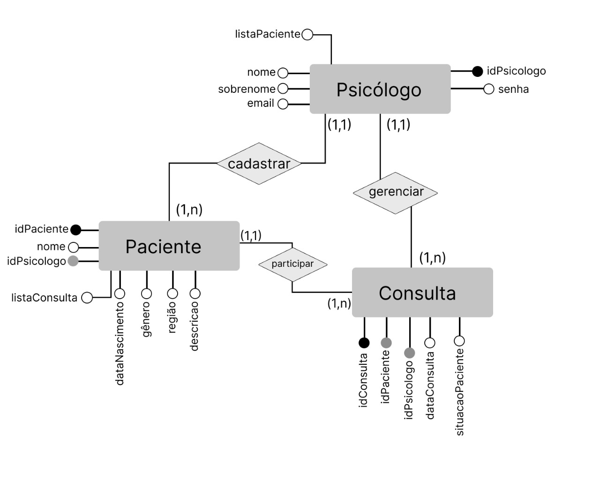

## Histórico de Versões

| Versão  |  Data  | Autor  |  Descrição  |
| ------------------- | ------------------- | ------------------- | ------------------- |
| 1.0.0 | 17/02/2021  | Davi Matheus  | Estrutura inicial  |
| 1.0.1 | 17/02/2021  | Nilvan Peres  | Adição dos tópicos 1,2 e 3 |
| 1.0.2 | 25/02/2021  | Antonio e Arthur | Implementação da Visão de Dados |
| 1.0.3 | 25/02/2021  | Natanel Fernandes | Adição do DER |
| 1.0.4 | 25/02/2021  | Davi e Aabrão | Implementação da Visão de Caso de Uso |
| 1.1.0 | 04/03/2021  | Davi e Aabrão | Atualização da Visão de Caso de Uso |
| 1.1.1 | 04/03/2021  | Antônio e Arthur | Atualização da Visão de Dados |
| 1.1.2 | 09/03/2021  | Nilvan Peres | Atualização link's sumários |
| 1.1.3 | 10/03/2021  |Lucas Lima | Adição do MTV ao Padrão Arquitetural |
| 1.2.0 | 14/03/2021  | Antônio | Atualização geral do documento |  
| 1.2.1 | 15/03/2021  | Davi | Atualização do topico 5 | 
| 1.2.2 | 16/03/2021  | Lucas | Atualização no tópico 2.2 |
## Sumário
[1 - Introdução](#1---introdução)
* [1.1 - Objetivo](#1.1---objetivo)
* [1.2 - Escopo](#1.2---escopo)
* [1.3 - Visão Geral](#1.3---Visão-Geral)
* [1.4 - Definições, acrônimos e abreviações](#1.4---Definições,-acrônimos-e-abreviações)

[2 - Represetanção de Arquitetura](#2---Represetanção-de-Arquitetura)

* [2.1 - Padrão Arquitetural](###2.1---Padrão-Arquitetural)
* [2.2 - Tecnologias](#2.2---Tecnologias)

[3 - Metas e Restrições da Arquitetura](#3---Metas-e-Restrições-da-Arquitetura)

* [3.1 - Metas](#3.1---Metas)
* [3.2 - Restrições da Arquitetura](#3.2---Restrições-da-Arquitetura)

[4 - Visão de Dados](#4---Visão-de-Dados)
* [4.1 - Modelo Entidade Relacionamento (MER)](#4.1---Modelo-Entidade-Relacionamento-(MER)) 
    * [4.1.1 - Entidades](#4.1.1---Entidades)
    * [4.1.2 - Relacionamentos](#4.1.2---Relacionamentos)
* [4.2 - Diagrama Entidade Relacionamento (DER)](#4.2---Diagrama-Entidade-Relacionamento-(DER)) 

[ 5 - Visão de Caso de Uso](#5---Visão-de-Caso-de-Uso)

* [5.1 - Diagrama de caso de Uso](#5.1---Diagrama-de-caso-de-Uso)
* [5.2 - Atores de Caso de Uso](#5.2---Atores-de-Caso-de-Uso)
* [5.3 - Descrições de Caso de Uso](#5.3---Descrições-de-Caso-de-Uso)
## 1 - Introdução

### 1.1 - Objetivo 
O objetivo deste documento é dissecar a arquitetura do projeto ***Cheery Up***, de modo que, todo a visão arquitetural do sistema que será desenvolvido esteja clara.  
Outro ponto que será abordado, são as principais características do software permitindo que desenvolvedores/gestores entendam os processos que levaram na escolha das tecnologias e decisões a respeito dessa arquitetura.

### 1.2 - Escopo
A plataforma web ***Cheery Up***, desenvolvida para psicólogos e profissionais da saúde psicológica, será um prontuário de monitoramento da saúde mental da uma comunidade. Nessa plataforma, o psicólogo se cadastra e tem acesso à ferrramentas que irão facilitar o monitoramento da saúde mental de cada paciente que desejar cadastrar, além do usufruto de Dashboards para a observação geral da comunindade. Também há o business inteligence a partir dos dados inseridos pelos psicológos.
Os componenete de software, frameworks, plataformas de desenvolvimento utilizados serão descritos neste documento.

### 1.3 - Visão Geral
Este documento é dividio nas seguintes seções:
* Introdução: Explica o propósito e organização do documento.
* Representação Arquitetural: Apresenta a arquitetura adotada para desenvolver o projeto.
* Metas e Requisitos de Software: Destrincha os requisistos de usabilidade do software, e as metas mais relevantes para o sistema que será desenvolvido.
* Visão de dados: Apresentação de todos os dados e métricas da aplicação.
* Visão de Casos de uso: Apresentação de todos os casos de uso da aplicação.
* Referências bibliográficas: Material de apoio na elaboração desse documento

### 1.4 - Definições, acrônimos e abreviações

| **Sigla/Termo/Acrônimo** | **Definição** |
| ------------------------ | ------------- |
| API | Application Programming Interface | 
| OMR | Mapeamento de objeto Relacional | 
| MDS | Métodos de Desenvolvimento de Software | 
| EPS | Engenharia de Produto de Software| 
| FGA | Faculdade do Gama | 
| UnB | Universidade de Brasília | 
| DRF | Django Rest Framework |
| MTV | Model Template View |
| MVC | Model View Controller |

## 2 - Represetanção de Arquitetura

	

### 2.1 - Padrão Arquitetural
O padrão de aquitetura MVC (Modelo Visão e Controle) é um modelo que contribui na otimização da velocidade entre as requisições feitas pelo comando do usuário. Cada componente da arquitetura é construído para lidar com alguma parte específica do desenvolvimento da aplicação. Os três componentes que serão utilizados nesse projeto serão destrinchados abaixo: 
* Model: Esse componente armazena dados, e está relacionado com a parte lógica. Essa parte será desempenhada pelos framework Django e com o mySQL para a manipulação de dados;
* View: É parte da aplicação que será visível ao usuário, a apresentação dos dados. A ferramenta que fará isso no nosso projeto é o react.js;
* Controller: É parte que lida com a interação do usuário com a aplicação, ele interpreta as inputs do usuário, comunica a model e a view muda de acordo as mudanças feitas.

O Django utiliza o MTV (Modelo de template e visão). Toda esta arquitetura é interligada e conversam entre si. Uma depende da outra para realizar um determinado serviço e, no final, executar a tarefa que o usuário solicitou. Quando o usuário faz uma requisição pelo browser, utilizando uma rota, é executado um método das Views, que utiliza os Models para acessar o banco de dados e retornar as informações. Estas informações são renderizadas pela camada de Template e, finalmente, é renderizado para o usuário pelo navegador.
* Model: Mapeamento do banco de dados para o projeto;
* Template: Páginas para visualização de dados. Normalmente, é aqui que fica o HTML que será renderizado nos navegadores;
* View: Lógica de negócio. É aqui que determinamos o que irá acontecer em nosso projeto.

### 2.2 - Tecnologias
|tecnologias | descrição |
| ------------------- | ------------------- |
| Python | Linguagem para o desenvolvimento do backend |
| Django | Framework que segue a arquitetura MTV, fará comunicação do back com o banco de dados |
| MkDocs | Gerador de site estático, voltado a criação de documentações markdown
|Bootstrap |  Framework para desenvolvimento em HTML e JS. |
| React |  Biblioteca em javascript com foco em criar inteface de usuário em páginas web. |
|Docker | Criação e administração de ambientes de desenvolvimento |
|Docker-compose |  Para a comunicação dos containers criados pelo docker |
|Git | Git é um sistema de controle de versão distruibuído, com estímulos a projetos open source |
|HTML |  Será utiliza para implementação do frontend junto ao JS e CSS |
|CSS | Linguagem para estilização de uma interface web |
|JavaScript |  Alia-se no desenvolvimento do frontend junto com HTML e CSS|
|mySQL | Banco de dados relacional, será usado para gerir a base de dados|

  

### 3 - Metas e Restrições da Arquitetura

#### 3.1 - Metas
* Facilitar o acompanhamento psicológico;
* Automatizar registros de atendimentos;
* Acompanhamento no quadro de evolução dos pacientes;
* Dashboards com métricas e indicadores da saúde mental de determinada comunidade; 

#### 3.2 - Restrições da Arquitetura
* Ter acesso a internet;
* Possuir um navegador de internet (Google Chrome 60, Safari, Mozilla Firefox 55, Opera 47 e Microsoft Edge);
* Cadastro no site;

## 4 - Visão de Dados

### 4.1 - Modelo Entidade Relacionamento (MER)

### 4.1.1 - Entidades
* ### Psicólogo 
|Atributos| Propriedade | Tipo | Descrição|
|-----|-----|------|-----|
| idPsicologo | Chave primária obrigatória | Integer | Identificação do Psicólogo |
| nome | Obrigatório | String | Nome do Psicólogo |
| email | Obrigatório | String | Email do Psicólogo |
| nCRP | Obrigatório | Integer | Número do Conselho Regional do Psicólogo |
| senha | Obrigatório | String | Senha de login |
| listaPacientes | Obrigatório | Paciente | Lista de pacientes do psicólogo|

* ### Paciente
|Atributos| Propriedade | Tipo | Descrição|
|-----|-----|------|-----|
| idPaciente | Chave primária obrigatória | Integer | Identificação do paciente |
| idPsicologo | Chave estrangeira obrigatória | Integer | Identificação do psicólogo |
| nome | Obrigatório | String | Nome do paciente |
| nascimento | Obrigatório | Date | Data de nascimento do paciente |
| genero | Obrigatório | Char | Gênero do paciente |
| regiao | Obrigatório | String | Região onde mora o paciente |
| descricao | Optativo | String | Descrição do caso do paciente |
| listaConsulta | Obrigatório | Consulta | Lista das consultas do paciente |

* ### Consulta
|Atributos| Propriedade | Tipo | Descrição|
|-----|-----|------|-----|
| idConsulta | Chave primária obrigatória | Integer | Identificação da Consulta |
| idPaciente | Chave estrangeira obrigatória | Integer | Identificação do Paciente |
| idPsicologo | Chave estrangeira obrigatória | Integer | Identificação do Psicólogo |
| dataConsulta| Obrigatório | String| Data que ocorre a consulta |
| situacaoPaciente | Obrigatório | String | Situação mental do paciente problema |
### 4.1.2 - Relacionamentos

**Psicólogo** -- cadastra/exclui -- **Paciente**: Um psicólogo cadastra ou exclui os pacientes. (Cardinalidade 1:N)

**Psicólogo** -- cadastra/exclui -- **Psicólogo**: Um psicólogo realiza seu próprio cadastro e eventual exclusão do mesmo. (Cardinalidade 1:1)

**Psicólogo** -- cadastra/exclui -- **Consulta**: Psicólogo cadastra ou exclui consultas de um paciente. (Cardinalidade 1:N)

**Psicólogo** -- insere -- **Paciente**: Psicólogo insere novos dados de uma consulta com paciente. (Cardinalidade 1:N)

**Psicólogo** -- acessa -- **Consulta**: Psicólogo altera dados de uma consulta com paciente. (Cardinalidade 1:N)

**Psicólogo** -- acessa -- **Paciente**: Psicólogo acessa seus pacientes e respectivos dados. (Cardinalidade 1:N)

### 4.2 - Diagrama Entidade Relacionamento (DER)

	

## 5 - Visão de Caso de Uso

### 5.1 - Diagrama de caso de Uso

	

### 5.2 - Atores de Caso de Uso

|Ator | Descrição | 
|-----|-----|
| Usúario | São todos que forem utilizar o site, ou seja, o psicólogo | 
| Psicologo | É quem vai utilizar o site para o cadastro e gerenciamento do paciente, visualizar o laudo e acessar os dashboards  | 

### 5.3 - Descrições de Caso de Uso

|Casos de uso| Ator | Descrição|
|-----|-----|------|
| UC01 - Efeituar Login | Psicologo | O psicologo poderá realizar seu cadastro e dar login e logout na plataforma quando quiser |
| UC02 - Cadastrar/Exlcluir paciente | Psicologo | O psicólogo poderá acessar cadastrar ou exluir um paciente em específico |
| UC02 - Alterar perfil Psicologo | Psicólogo | O psicologo poderá alterar seu perfil quando desejar |
| UC03 - Alterar perfil Paciente| Psicologo | O psicologo poderá alterar o perfil dos seus pacientes quando desejar |
| UC04 - Mostrar pacientes cadastrados | Psicologo |  O psicólogo poderá acessar e visualizar as informações de um paciente em específico   |
| UC04 - Acessar laudo dos pacientes | Psicologo | O psicólogo poderá acessar os laudos que ele preencher |
| UC05 - Adicionar novos laudos a pacientes | Psicologo | O psicólogo pode inserir os laudos dos seus pacientes |
| UC06 - Acessar Dashboards|  Psicologo | O psicólogo poderá ver os dashbords de saúde mental disponiblizados pela comunidade |
| UC07 - Acessso aos quadros evolutivos | O psicólogo poderá acessar o quadro evolutivo de um paciente específico | 
